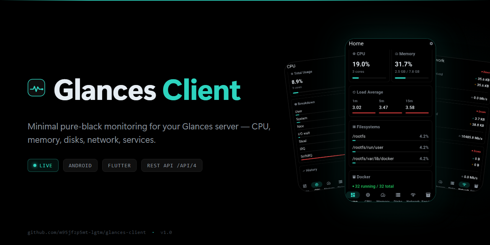
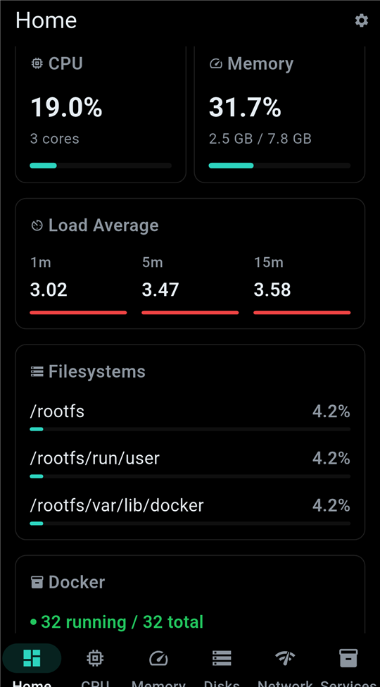
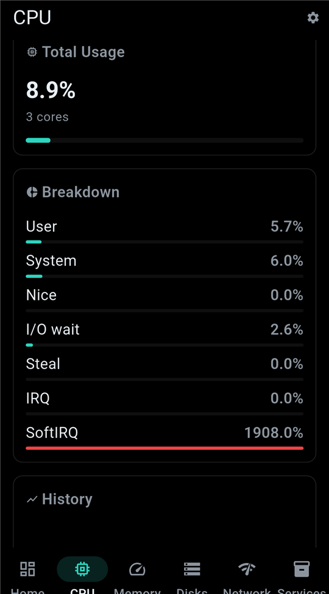
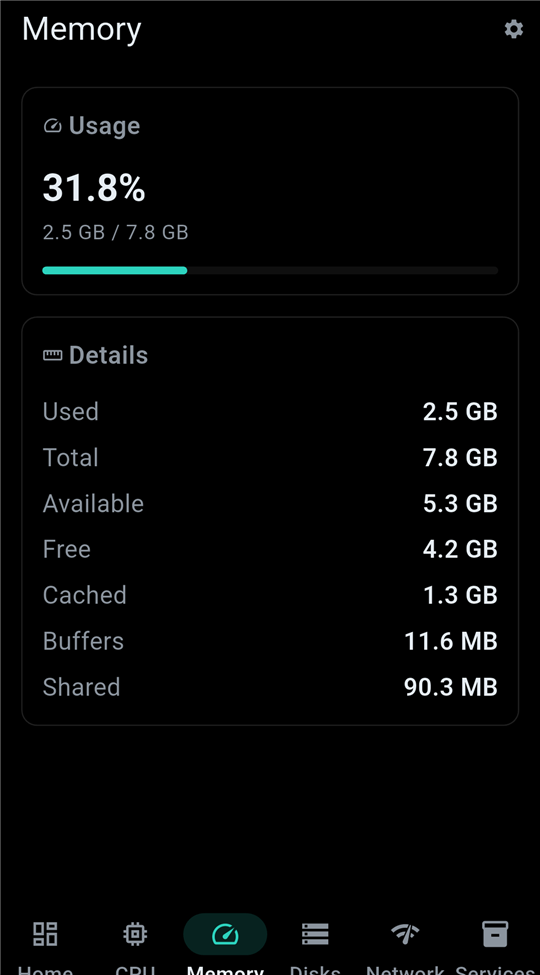
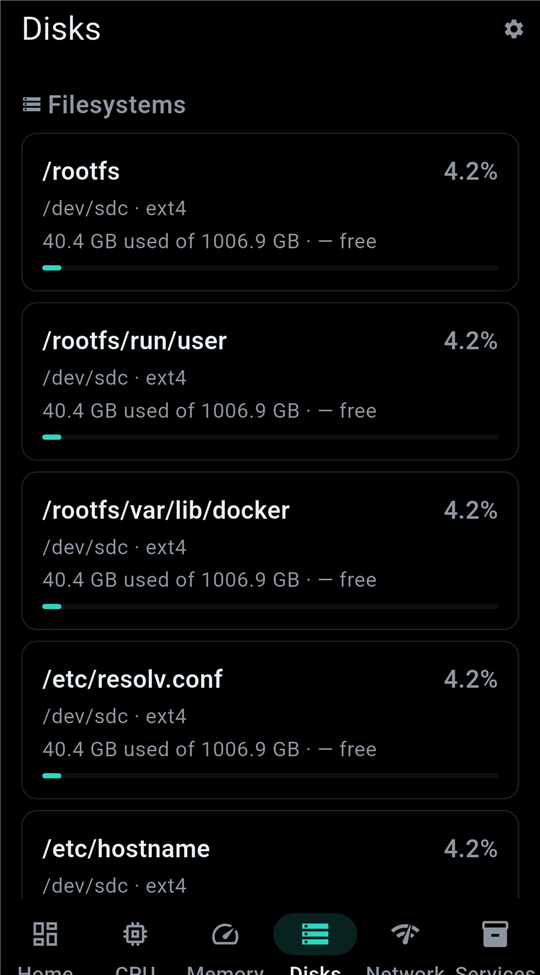
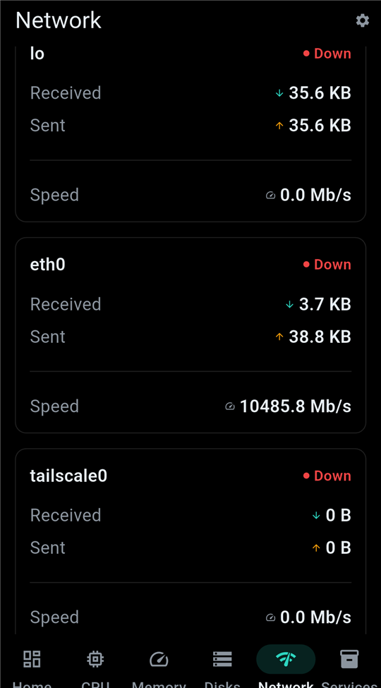
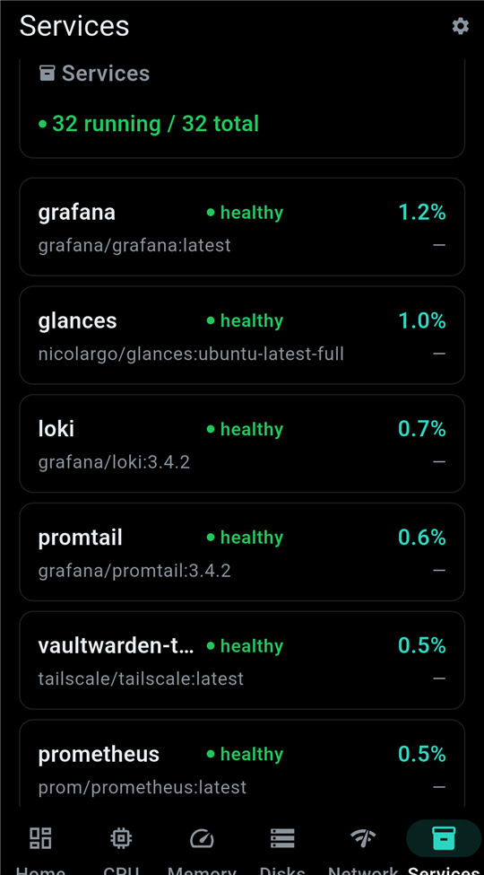
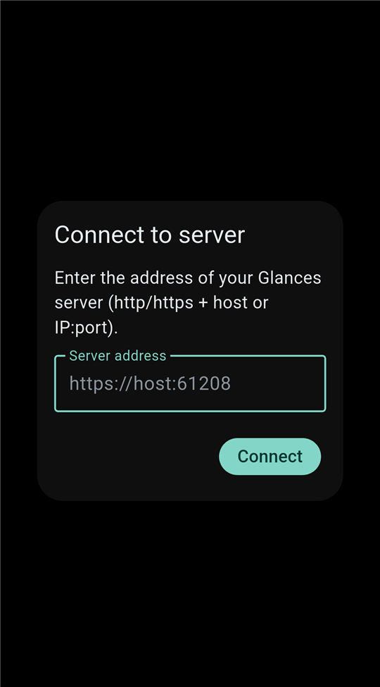

# Glances Client



[](https://github.com/jamaicanyutie/glances-client/actions/workflows/ci.yml)
[](https://github.com/jamaicanyutie/glances-client/releases)
[](https://github.com/jamaicanyutie/glances-client/releases)
[](LICENSE)

Native Android monitoring clients for the [Glances](https://github.com/nicolargo/glances) system monitoring tool. Both apps talk directly to the Glances REST API (`/api/4`) and render the live dashboard on a battery-friendly pure-black (AMOLED) screen.

This repository contains two Flutter apps:

| App | Path | Description |
|-----|------|-------------|
| **Glances Client** (minimal) | [`minimal/`](minimal/) | A deliberately lean, read-only mobile client. |
| **Glances Client Advanced** | [`advanced/`](advanced/) | A feature-rich client with drill-down detail screens, history charts, discovery and more. |

## Screenshots (minimal)

| | | |
|---|---|---|
|  |  |  |
|  |  |  |

| |
|---|
|  |

## Requirements

- A running [Glances](https://github.com/nicolargo/glances) server (v4 API) reachable from your device
- The Glances server should have the REST API enabled (`glances -w`)

## Installation

Download the latest APK from the [Releases](../../releases) page and install it on your Android device (allow "install from unknown sources" if prompted).

On first launch, enter your Glances server address and tap **Connect**.

## Building from source

Each app is a self-contained Flutter project. From its directory:

```bash
cd minimal    # or: cd advanced
flutter pub get
flutter build apk --release
```

The APK is written to `build/app/outputs/flutter-apk/app-release.apk`.

## License

See [LICENSE](LICENSE).

Third-party notices (including the LGPL-licensed Glances logo used by the
advanced app icon): [`advanced/THIRD_PARTY_NOTICES.txt`](advanced/THIRD_PARTY_NOTICES.txt).
